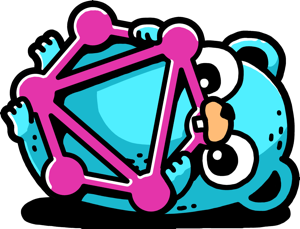

# graphql-go [](https://sourcegraph.com/github.com/graph-gophers/graphql-go?badge) [](https://semaphoreci.com/graph-gophers/graphql-go) [](https://godoc.org/github.com/graph-gophers/graphql-go)

<p align="center"></p>

The goal of this project is to provide full support of the [GraphQL draft specification](https://facebook.github.io/graphql/draft) with a set of idiomatic, easy to use Go packages.

While still under heavy development (`internal` APIs are almost certainly subject to change), this library is
safe for production use.

## Features

- minimal API
- support for `context.Context`
- support for the `OpenTracing` standard
- schema type-checking against resolvers
- resolvers are matched to the schema based on method sets (can resolve a GraphQL schema with a Go interface or Go struct).
- handles panics in resolvers
- parallel execution of resolvers

## Roadmap

We're trying out the GitHub Project feature to manage `graphql-go`'s [development roadmap](https://github.com/graph-gophers/graphql-go/projects/1).
Feedback is welcome and appreciated.

## (Some) Documentation

### Basic Sample

```go
package main

import (
        "log"
        "net/http"

        graphql "github.com/graph-gophers/graphql-go"
        "github.com/graph-gophers/graphql-go/relay"
)

type query struct{}

func (_ *query) Hello() string { return "Hello, world!" }

func main() {
        s := `
                schema {
                        query: Query
                }
                type Query {
                        hello: String!
                }
        `

        engine, err := graphql.CreateEngine(starwars.Schema)
        if err != nil {
            log.Fatal((err)
        }

        engine.Root = &query{}
        http.Handle("/query", &relay.Handler{Engine: engine})
        log.Fatal(http.ListenAndServe(":8080", nil))
}
```

To test:
```sh
$ curl -XPOST -d '{"query": "{ hello }"}' localhost:8080/query
```

### Resolvers

Resolvers implement accessing that data selected by the GraphQL query or mutations.

When a graphql field is access, we the graphql engine tries using the following resolver factories until one of them
is able to create a resolver for the field:
1. `resolvers.MetadataResolverFactory`: Resolves the `__typename`, `__schema`, and `__type` metadata fields.
2. `resolvers.MethodResolverFactory`: Resolves the field using exported functions implemented on the current struct
3. `resolvers.FieldResolverFactory`: Resolves the field using exported fields on the current struct
4. `resolvers.MapResolverFactory`: Resolves the field using map entries on the current map.

If no resolver factory can resolve the GraphQL field, then it results in a GraphQL error.

#### Resolving fields using `resolvers.MethodResolverFactory`

The method name has to be [exported](https://golang.org/ref/spec#Exported_identifiers) and match the field's name
in a non-case-sensitive way.

The method has up to two arguments:

- Optional `context.Context` argument or `resolvers.ExecutionContext`.
- Mandatory `*struct { ... }` argument if the corresponding GraphQL field has arguments. The names of the struct
fields have to be [exported](https://golang.org/ref/spec#Exported_identifiers) and have to match the names of the
GraphQL arguments in a non-case-sensitive way.

The method has up to two results:

- The GraphQL field's value as determined by the resolver.
- Optional `error` result.

Example for a simple resolver method:

```go
func (r *helloWorldResolver) Hello() string {
	return "Hello world!"
}
```

The following signature is also allowed:

```go
func (r *helloWorldResolver) Hello(ctx resolvers.ExecutionContext) (string, error) {
	return "Hello world!", nil
}
```


#### Resolving fields using `resolvers.FieldResolverFactory`

The method name has to be [exported](https://golang.org/ref/spec#Exported_identifiers). The GraphQL field's name
must match the struct field name or the name in a `json:""` annotation.

Example of a simple resolver struct:

```go
type Query struct {
	Name   string
	Length float64  `json:"length"`
}
```

Could be access with the following GraphQL type:

```graphql
type Query {
    Name: String!
    length: Float!
}
```

#### Resolving fields using `resolvers.MapResolverFactory`

You must use maps with string keys.

Example of a simple resolver map:

```go
query := map[string]interface{}{
	"Name": "Millennium Falcon",
	"length": 34.37,
}
```

Could be access with the following GraphQL type:

```graphql
type Query {
    Name: String
    length: Float
}
```

### Custom Resolvers

You can change the resolver factories used by the engine and implement custom resolver factories if needed.

Changing the default list of resolver factories so that only metadata and method based resolvers are used:
```go
        engine, err := graphql.CreateEngine(starwars.Schema)
        engine.ResolverFactory = &resolvers.ResolverFactoryList{
        		&resolvers.MetadataResolverFactory{},
        		&resolvers.MethodResolverFactory{},
        }
```

You can also implement a custom resolver factory.  Here's an example resolver factory, that would resolve all `foo` GraphQL
fields to the value `"bar"`:

```go
type MyFooResolverFactory struct{}
func (this *MyFooResolverFactory) CreateResolver(request *resolvers.ResolveRequest) resolvers.Resolver {
	if request.Field.Name!="foo" {
		return nil // Lets only handle the foo fields:
	}
	return func() (interface{}, error) {
		return "bar", nil
	}
}
```

or you could do like:

```go
myFooResolverFactory := resolvers.FuncResolverFactory{ func (request *resolvers.ResolveRequest) resolvers.Resolver {
	if request.Field.Name!="foo" {
		return nil // Lets only handle the foo fields:
	}
	return func() (interface{}, error) {
		return "bar", nil
	}
}}
```

If you only want to apply a custom resolver for a specific GraphQL type, you can do it like:
```go
myTypeResolverFactory := resolvers.TypeResolverFactory {
    "Query": func (request *resolvers.ResolveRequest) resolvers.Resolver {
        if request.Field.Name!="foo" {
            return nil // Lets only handle the foo fields:
        }
        return func() (interface{}, error) {
            return "bar", nil
        }
    },
}
```

### Async Resolvers

If resolvers are going to fetch data from multiple remote systems, you will want to resolve those async so that
each fetch is done in parallel.  You can enable async resolution in your custom resolver using the following pattern:

```go
type MyHttpResolverFactory struct{}
func (this *MyHttpResolverFactory) CreateResolver(request *resolvers.ResolveRequest) resolvers.Resolver {

	if request.Field.Name!="google" {
		return nil // Lets only handle the foo fields:
	}

    httpClient := &http.Client{}
    req, err := http.NewRequest("GET", "http://google.com", nil)
    if err==nil {
        panic(err)
    }

	return request.RunAsync(func() (interface{}, error) {
        resp, err := httpClient.Do(req)
        if err != nil {
            return nil, err
        }
        defer resp.Body.Close()

        data, err := ioutil.ReadAll(resp.Body)
        if err != nil {
            return nil, err
        }

		return string(data), nil
	})
}
```

### Community Examples

[tonyghita/graphql-go-example](https://github.com/tonyghita/graphql-go-example) - A more "productionized" version of the Star Wars API example given in this repository.

[deltaskelta/graphql-go-pets-example](https://github.com/deltaskelta/graphql-go-pets-example) - graphql-go resolving against a sqlite database

[OscarYuen/go-graphql-starter](https://github.com/OscarYuen/go-graphql-starter) - a starter application integrated with dataloader, psql and basic authentication
