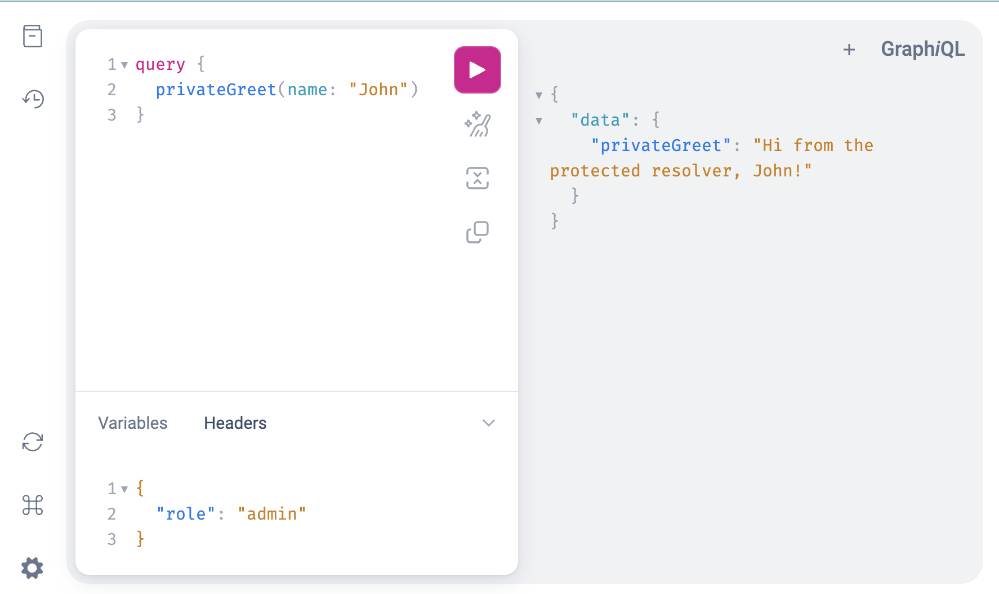

# @hasRole directive

## Overview
A simple example of naive authorization directive which returns an error if the user in the context doesn't have the required role. Make sure that in production applications you use thread-safe maps for roles as an instance of the user struct might be accessed from multiple goroutines. In this naive example we use a simeple map which is not thread-safe. The required role to access a resolver is passed as an argument to the directive, for example, `@hasRole(role: ADMIN)`.

## Getting started
To run this server

`go run ./example/directives/authorization/server/server.go`

Navigate to https://localhost:8080 in your browser to interact with the Graph<i>i</i>QL UI.

## Testing with curl
Access public resolver:
```
$ curl 'http://localhost:8080/query' \
  -H 'Accept: application/json' \
  --data-raw '{"query":"# mutation {\nquery {\n  publicGreet(name: \"John\")\n}","variables":null}'

{"data":{"publicGreet":"Hello from the public resolver, John!"}}
```
Try accessing protected resolver without required role:
```
$ curl 'http://localhost:8080/query' \
  -H 'Accept: application/json' \
  --data-raw '{"query":"# mutation {\nquery {\n  privateGreet(name: \"John\")\n}","variables":null}'
{"errors":[{"message":"access denied, \"admin\" role required","path":["privateGreet"]}],"data":null}
```
Try accessing protected resolver again with appropriate role:
```
$ curl 'http://localhost:8080/query' \
  -H 'Accept: application/json' \
  -H 'role: admin' \
  --data-raw '{"query":"# mutation {\nquery {\n  privateGreet(name: \"John\")\n}","variables":null}'
{"data":{"privateGreet":"Hi from the protected resolver, John!"}}
```

## Implementation details

1. Add directive definition to your shema:
    ```graphql
        directive @hasRole(role: Role!) on FIELD_DEFINITION
    ```

2. Add directive to the protected fields in the schema:
    ```graphql
        type Query {
            # other field resolvers here
            privateGreet(name: String!): String! @hasRole(role: ADMIN)
        }
    ```

3. Define a user Go type which can be assigned to different roles where each role is a string:
    ```go
    type User struct {
        ID    string
        Roles map[string]struct{}
    }

    func (u *User) AddRole(r string) {
        if u.Roles == nil {
            u.Roles = map[string]struct{}{}
        }
        u.Roles[r] = struct{}{}
    }

    func (u *User) HasRole(r string) bool {
        _, ok := u.Roles[r]
        return ok
    }
    ```

4. Define a Go type which implements the `directives.Directive` interface:
    ```go
    type HasRoleDirective struct{
        Role string
    }

   func (h *HasRoleDirective) ImplementsDirective() string {
       return "hasRole"
   }

    func (h *HasRoleDirective) Resolve(ctx context.Context, args interface{}, next directives.Resolver) (output interface{}, err error) {
        u, ok := user.FromContext(ctx)
        if !ok {
            return nil, fmt.Errorf("user not provided in context")
        }
        role := strings.ToLower(h.Role)
        if !u.HasRole(role) {
            return nil, fmt.Errorf("access denied, %q role required", role)
        }
        return next.Resolve(ctx, args)
    }
    ```

5. Pay attention to the schmema options. Directive visitors are added as schema option:
    ```go
        opts := []graphql.SchemaOpt{
            graphql.Directives(
                &authorization.HasRoleDirective{},
                // additional directives
            ),
            // other options go here
        }
        schema := graphql.MustParseSchema(authorization.Schema, &authorization.Resolver{}, opts...)
    ```

6. Add a middleware to the HTTP handler which would read the `role` HTTP header and add that role to the slice of user roles. This naive middleware assumes that there is authentication proxy (e.g. Nginx, Envoy, Contour etc.) in front of this server which would authenticate the user and add their role in a header. In production application it would be fine if the same application handles the authentication and adds the user to the context. This is the middleware in this example:
    ```go
    func auth(next http.Handler) http.Handler {
        return http.HandlerFunc(func(w http.ResponseWriter, r *http.Request) {
            u := &user.User{}
            role := r.Header.Get("role")
            if role != "" {
                u.AddRole(role)
            }
            ctx := user.AddToContext(context.Background(), u)
            next.ServeHTTP(w, r.WithContext(ctx))
        })
    }
    ```

7. Wrap the GraphQL handler with the auth middleware:
    ```go
        http.Handle("/query", auth(&relay.Handler{Schema: schema}))
    ```

8. In order to access the private resolver add a role header like below:

